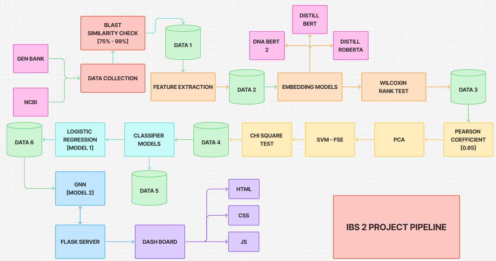

# 🧬 Network Analysis on Antibiotic Resistance Evolution Paths

<p align="center">
  
</p>

<p align="center">
  <b>A Machine Learning and Graph-Based Framework for Antibiotic Resistance Analysis</b>
</p>

---

# 📌 Overview

Antimicrobial Resistance (AMR) is one of the biggest global health threats worldwide.  
This project focuses on studying the **optrA gene**, a transferable resistance gene associated with resistance against:

- 💊 Oxazolidinones
- 💊 Phenicols

The project combines:

- 🧪 Biological feature extraction
- 🤖 Transformer-based DNA embeddings
- 📊 Machine Learning classification
- 🕸️ Graph-based resistance locus detection
- 🧠 Explainable AI
- 🌐 Interactive visualization dashboard

to create a complete computational pipeline for resistance prediction and evolutionary pathway analysis.

---

# 🖼️ Workflow Architecture

> Make sure `Flowchart.png` is present in the main branch/root folder.

<p align="center">
  
</p>

---

# ✨ Features

✅ optrA sequence collection from NCBI & GenBank  
✅ DNA feature extraction  
✅ Transformer embedding generation  
✅ Feature selection and dimensionality reduction  
✅ Multiple classifier comparisons  
✅ Logistic Regression resistance prediction  
✅ Graph-based resistance locus analysis  
✅ SHAP & LIME explainability  
✅ Flask-based visualization dashboard  

---

# 🔄 Project Pipeline

```text
Sequence Collection
        ↓
Quality Filtering
        ↓
Feature Extraction
        ↓
DNA Embedding Generation
        ↓
Feature Selection
        ↓
Classifier Training
        ↓
Resistance Prediction
        ↓
Graph-Based Locus Detection
        ↓
Visualization Dashboard
```

---

# 🗂️ Dataset Information

| Property | Description |
|---|---|
| Source | NCBI & GenBank |
| Target Gene | optrA |
| Approximate Sequences | ~1500 |
| Sequence Length | 500–1000 bp |

The dataset contains:

- DNA sequences
- Metadata
- Extracted biological features
- Embedding vectors
- Resistance labels

---

# 🛠️ Technologies Used

## 💻 Programming Language

- Python

## 📦 Libraries & Frameworks

| Module | Purpose |
|---|---|
| numpy | Numerical operations |
| pandas | Data handling |
| scikit-learn | ML models & preprocessing |
| scipy | Statistical analysis |
| networkx | Graph construction |
| matplotlib | Visualization |
| transformers | DNA transformer embeddings |
| torch | Deep learning backend |
| Bio.Entrez | NCBI sequence retrieval |
| requests | API/web data collection |
| BeautifulSoup | HTML metadata extraction |
| openpyxl | Excel report generation |
| Flask | Backend dashboard |
| SHAP | Explainable AI |
| LIME | Local model explainability |

---

# 🧪 Feature Extraction

A total of **51 biological features** are extracted from every sequence, including:

- 🔬 Base pair composition
- 🧩 k-mer analysis
- 🧬 Mutation indicators
- 🧫 Insertion sequence markers
- 🧪 Resistance-associated motifs

## 🏷️ Class Labels

| Label | Meaning |
|---|---|
| 0 | Non-resistant |
| 1 | Resistant |

---

# 🤖 Embedding Models

The following transformer models were evaluated:

1. DNA-BERT 2
2. DistilBERT
3. DistilRoBERTa

Each sequence generated:

- `768-dimensional embeddings`

## 🏆 Best Embedder

✅ **DistilRoBERTa**

### Why?

- Highest Mean CV Score (`0.633`)
- Better contextual understanding
- Stable representation quality

---

# 🎯 Feature Selection

The pipeline applies:

- 📉 Pearson Correlation Filtering
- 📊 PCA (Principal Component Analysis)
- ⚡ SVM-based supervised feature selection
- 📐 Chi-Square Testing

## 📌 Final Data Split

```text
Training : Validation : Testing
60 : 20 : 20
```

---

# 📈 Classification Models

The following classifiers were compared:

- K-Nearest Neighbors (KNN)
- Logistic Regression
- SVM (RBF Kernel)
- Naive Bayes
- Gradient Boosting

## 🥇 Best Performing Model

✅ **Logistic Regression**

### 📊 Metrics

| Metric | Score |
|---|---|
| Accuracy | 75% |
| Precision | Good |
| Recall | Good |
| F1 Score | Strong |
| AUROC | High |

---

# 🕸️ Graph-Based Resistance Analysis

The second model focuses on:

- 🧬 Resistance locus detection
- 🌐 Graph traversal on sequence k-mers
- 🛤️ Evolutionary resistance path analysis

Implemented using:

- Eulerian graph construction
- Graph Neural Network concepts
- NetworkX

The graph model identifies:

- 📍 Important resistance loci
- 📊 High-scoring resistance regions
- 🔗 Sequence evolution paths

---

# 🔍 Explainable AI

The project integrates:

- SHAP
- LIME
- Spearman Correlation Analysis

to interpret:

- 🧠 Important biological features
- 📌 Feature contributions
- 🤝 Model agreement

---

# 🌐 User Interface

The Flask-based dashboard provides:

✅ Sequence input  
✅ Resistance prediction  
✅ Confidence scores  
✅ Graph visualizations  
✅ Resistance loci ranking  
✅ Server history tracking  

---

# 📁 Project Structure

```text
├── __pycache__/
├── LIME/
├── ROC Curves/
├── SHAP/
├── Test Sequences/
│
├── Data_1.xlsx
├── Data_2.xlsx
├── Data_3.xlsx
├── Data_4.xlsx
├── Data_5.xlsx
├── Data_6.xlsx
│
├── data_collection.py
├── feature_extraction.py
├── feature_selection.py
├── embeddings.py
├── models.py
├── model1.py
├── model2.py
├── server.py
│
├── app.js
├── index.html
├── style.css
│
├── Flowchart.png
├── logo.png
│
└── README.md
```

---

# ⚙️ Installation

## 📥 Clone the Repository

```bash
git clone https://github.com/your-username/your-repository-name.git
```

## 📂 Move into the Project Directory

```bash
cd your-repository-name
```

## 📦 Install Dependencies

```bash
pip install -r requirements.txt
```

---

# 🚀 Running the Project

## ▶️ Run Classification Model

```bash
python model1.py
```

## ▶️ Run Graph-Based Model

```bash
python model2.py
```

## 🌐 Start Flask Server

```bash
python server.py
```

---

# 📊 Results

## 🏆 Best Embedder
- DistilRoBERTa

## 🥇 Best Classifier
- Logistic Regression

## 📈 Model Accuracy
- 75%

## 🔬 Major Contribution
- Resistance locus identification using graph analysis

---

# 🔮 Future Improvements

- 📡 Real-time genomic surveillance
- 🧠 Advanced GNN architectures
- ☁️ Cloud deployment
- 🧬 Multi-gene resistance analysis
- ⚡ Faster inference pipelines
- 📊 Enhanced biological explainability

---

# 📚 Research References

Key references include research on:

- optrA resistance genes
- DNABERT
- RoBERTa
- SHAP explainability
- Graph Convolutional Networks

---

# 👨‍💻 Authors

- Adina Sree Venkat Utham Kumar
- Saishree Sreekanth
- Avyuktha Y

---

# 📜 License

This project is intended for academic and research purposes.

---

# 🙏 Acknowledgements

- NCBI
- GenBank
- Hugging Face Transformers
- Scikit-learn
- NetworkX
- Flask
- SHAP
- LIME

---

<p align="center">
  ⭐ If you found this project useful, consider starring the repository!
</p>
